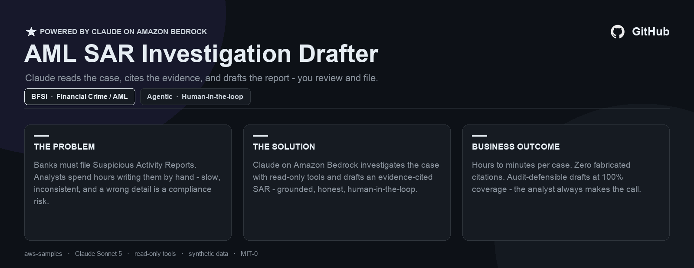
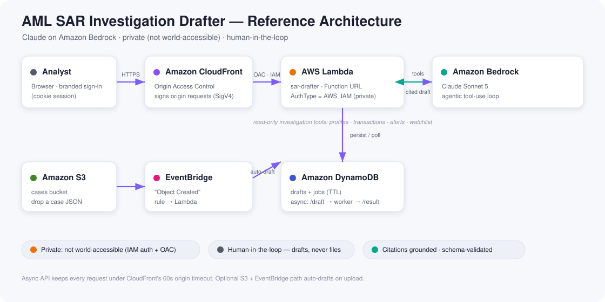

<div align="center">



<h1>AML SAR Investigation Drafter</h1>

<strong>Claude reads an anti-money-laundering case, cites the evidence, and drafts a<br/>regulator-ready Suspicious Activity Report narrative — you review and file.</strong>

<br/><br/>

[](#-the-problem)
[](LICENSE)
[](pyproject.toml)
[](https://aws.amazon.com/bedrock/)
[](#-responsible-use)
[](#-evaluation)
[](CONTRIBUTING.md)

<a href="#-quickstart">Quickstart</a> ·
<a href="#-architecture">Architecture</a> ·
<a href="#-how-it-works">How it works</a> ·
<a href="#-deploy-to-aws">Deploy</a> ·
<a href="SECURITY.md">Security</a>

</div>

---

> [!IMPORTANT]
> **Human-in-the-loop, always.** This tool produces a *draft* for review. It does
> not file SARs, does not contact subjects, and only reads case data. A qualified
> BSA/AML analyst verifies every fact and makes the filing decision. All bundled
> data is **synthetic**.

## 🧩 The problem

Every bank's financial-crime unit must file **Suspicious Activity Reports**. When
monitoring flags a case, an analyst has to read the transaction history, work out
what is suspicious, and write a *who / what / when / where / why* narrative for
the regulator.

- ⏳ **Hours per case.** It's slow, repetitive expert work, and quality varies by analyst.
- 📝 **The narrative is mandatory** — and it's what a regulator actually reads.
- 🤖 **No upstream system writes it.** Detection flags the case; the reasoning and
  the careful writing are entirely a human's job.
- ⚠️ **A wrong or invented detail is a compliance problem** — so grounding and
  honest uncertainty matter more than fluency.

## ✨ The solution

An agentic, **human-in-the-loop** drafter. Claude plans an investigation, calls
read-only tools to gather evidence, correlates it into a coherent story, and
produces a **structured, evidence-cited SAR draft** — or defers when the evidence
is thin. Runs fully **offline** with a bundled mock provider (no credentials
needed), with an optional, security-reviewed AWS deployment.

### Why Claude is the engine (not a wrapper)

Remove the model and you're left with raw alerts and nothing else.

| | |
|---|---|
| 🧠 **Reasoning over evidence** | Correlates deposits, wires, KYC, and alerts into one coherent story. |
| 🔗 **Citation discipline** | Every claim maps to a real transaction ID the agent retrieved — the eval enforces **zero** fabricated citations. |
| 🤔 **Honest hedging** | Ambiguous evidence → `needs_human_review` with open questions, not a forced call. |
| 📑 **Regulator-ready form** | The FinCEN five-element (who/what/when/where/why) narrative structure. |

### Three outcomes — commit, hedge, or clear

| Recommendation | When | What Claude produces |
|---|---|---|
| 🔴 `recommend_file` | Clear typology (e.g. structuring → rapid movement to a high-risk jurisdiction) | Full cited narrative + red flags + evidence map |
| 🟡 `needs_human_review` | Ambiguous (e.g. a cash-intensive business with a few near-threshold deposits) | Narrative + specific open questions; defers the call |
| 🟢 `recommend_no_file` | Benign; the alert has a documented explanation | Documents the no-file decision; cites nothing |

## 🏗️ Architecture

<div align="center">



</div>

Claude on Amazon Bedrock is the engine; the surrounding services keep it
**private** (CloudFront + Origin Access Control in front of an IAM-auth Lambda),
**asynchronous** (long investigations stay under CloudFront's 60s timeout), and
**event-driven** (drop a case in S3 and it auto-drafts). Full model in
[SECURITY.md](SECURITY.md).

## ⚙️ How it works

```
                 ┌─────────────────────────────────────────────┐
   case JSON ──▶ │  agent loop (bounded tool-use conversation)  │
                 │                                              │
                 │   Claude ⇄ read-only investigation tools     │
                 │     get_case_overview · get_subject_profile  │
                 │     get_account_activity · get_transactions  │
                 │     get_alerts · get_related_parties ·       │
                 │     get_prior_sars · lookup_watchlist        │
                 │                                              │
                 │   ↳ submit_sar  →  schema validation         │
                 └─────────────────────────────────────────────┘
                                     │
                                     ▼
                   validated SAR draft  →  markdown / JSON
```

The agent investigates first (it must retrieve data before drawing conclusions),
then calls `submit_sar` with a structured draft. The loop validates that draft
against a strict schema and returns any errors to the model to fix, within a
bounded round budget. Tools are strictly **read-only** — the safety boundary for
a defensive workflow.

## 🚀 Quickstart

No dependencies are needed for the offline run.

```bash
# 1) Offline, deterministic, no credentials (mock provider):
python run.py --provider mock --show-trace

# 2) Claude on Amazon Bedrock (needs boto3 + AWS creds with Bedrock access):
pip install -r requirements.txt
python run.py --provider bedrock --region us-east-1

# 3) Claude via the Anthropic API:
pip install -r requirements.txt
ANTHROPIC_API_KEY=sk-... python run.py --provider anthropic
```

Useful flags: `--json` (raw SAR JSON), `--out draft.md` (write to file),
`--case path/to/case.json` (your own case), `--model <id>`, `--max-rounds N`.

## 📊 Evaluation

The eval harness is what makes this a serious sample. It scores each draft on the
qualities that matter for a compliance artifact — above all **citation grounding**
(no fabricated transaction IDs).

```bash
python eval/run_eval.py                       # offline (mock)
python eval/run_eval.py --provider bedrock    # against Claude on Bedrock
```

Metrics: schema validity, citation grounding + hallucinated-ID count, typology
recall, subject coverage, recommendation match, activity-period sanity, and
amount floor. A case passes only when it is schema-valid, fully grounded, recalls
the expected typologies, and matches the expected recommendation.

## 🧪 Tests

```bash
python tests/test_sar_drafter.py     # or: python -m unittest discover -s tests
```

## ☁️ Deploy to AWS

Deploy the agent as a Lambda function backed by Claude on Bedrock, with a
DynamoDB table for drafts. The deploy is idempotent and re-runnable.

```bash
pip install boto3
python deploy/deploy.py                     # role + tables + function + test invoke
```

It provisions a scoped IAM role, DynamoDB tables (`sar-drafts`, `sar-jobs`), and
the `sar-drafter` Lambda (Python 3.12; boto3 from the runtime, no bundled deps).

```bash
# invoke the bundled synthetic case:
aws lambda invoke --function-name sar-drafter --payload '{}' \
  --cli-binary-format raw-in-base64-out out.json && cat out.json
```

### Web UI — CloudFront + private Lambda

```bash
python deploy/deploy_web.py       # private Function URL + CloudFront OAC + distribution
```

Serves a browser test page from CloudFront **without exposing the Lambda**: the
Function URL is `AuthType = AWS_IAM` (anonymous calls get 403), CloudFront
**Origin Access Control** signs each request (SigV4), and the Lambda resource
policy trusts only *this distribution's ARN*. The API is **asynchronous**
(`POST /draft` → `job_id` → poll `GET /result`) to stay under CloudFront's 60s
origin timeout. Satisfies AWS Security Hub **CloudFront.16**.

The UI offers a case picker, a tabbed report (Report · Evidence · Investigation ·
Raw), a grounding badge (verified vs. fabricated transactions), a confidence bar,
the investigation trace, and Markdown/JSON downloads.

### Sign-in — branded cookie session

```bash
python deploy/deploy_auth.py --user analyst              # random password (written to a 0600 file)
python deploy/deploy_auth.py --user demo --password <password>
python deploy/deploy_auth.py --remove                    # disable the login gate
```

A branded **sign-in page** gates the UI and all API routes with an HMAC-signed,
`HttpOnly`/`Secure` session cookie (8-hour TTL). Demo-grade — use Cognito/OIDC
for production identity.

### Event-driven auto-draft — S3 + EventBridge

```bash
python deploy/deploy_events.py    # cases bucket + EventBridge rule -> Lambda
aws s3 cp sample_data/cases/case_001_structuring.json \
  s3://sar-cases-<account>/incoming/case_001.json
```

Uploading a `*.json` case triggers the drafter; the result is stored in DynamoDB.

### Teardown

```bash
python deploy/teardown.py         # removes every resource this project creates
```

## 📁 Project structure

```
sample-amazon-bedrock-claude-sar-narrative-agent/
├── run.py                       # convenience launcher (no PYTHONPATH needed)
├── src/sar_drafter/
│   ├── schema.py                # SAR schema + dependency-free validation
│   ├── prompts.py               # investigator system prompt / playbook
│   ├── tools.py                 # read-only investigation tools + specs
│   ├── agent.py                 # bounded tool-use agent loop
│   ├── render.py                # SAR draft → markdown (+ disclaimer)
│   ├── cli.py                   # command-line entrypoint
│   └── providers/               # bedrock · anthropic · mock
├── deploy/                      # deploy.py, deploy_web.py, deploy_events.py, deploy_auth.py,
│                                #   teardown.py, teardown_web.py, lambda_handler.py
├── sample_data/cases/           # synthetic AML cases (no real PII)
├── eval/                        # labeled cases + scoring harness
├── tests/
└── docs/                        # banner + reference architecture diagram
```

## 🔒 Security

See [SECURITY.md](SECURITY.md) for the security model, vulnerability reporting,
data classification (synthetic only — no PII), least-privilege IAM, and the
responsible-AI / prompt-injection posture.

## ⚖️ Responsible use

Decision-support software for licensed institutions operating on their own data.
It must not be used to evade detection, and it never replaces the independent
judgment of a qualified analyst or the institution's filing obligations. Verify
every fact against source systems before filing.

## 📄 License

[MIT-0](LICENSE) — MIT No Attribution.
